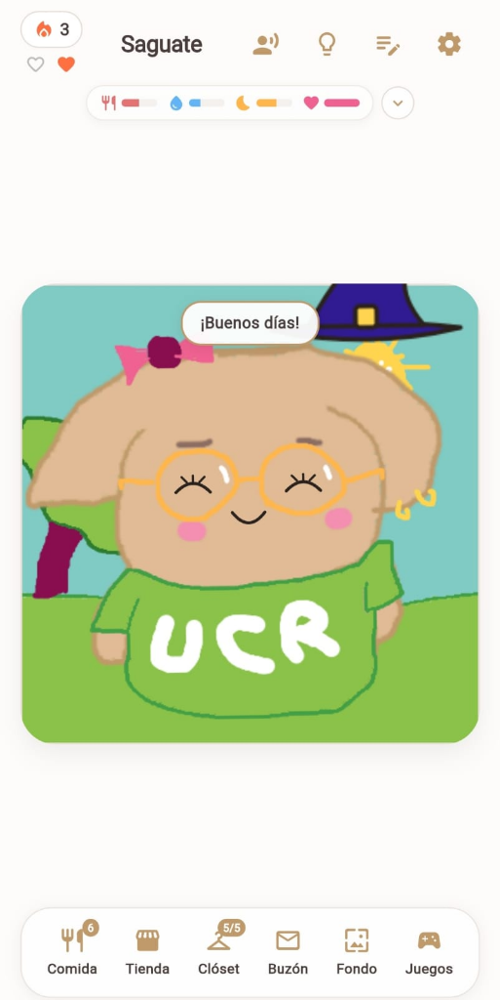
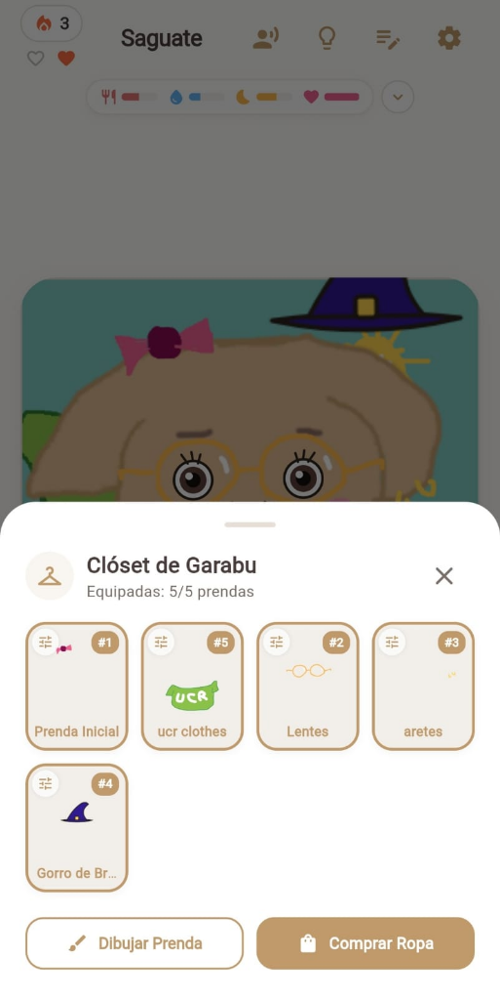
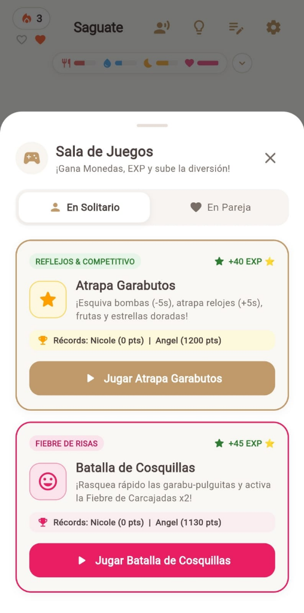
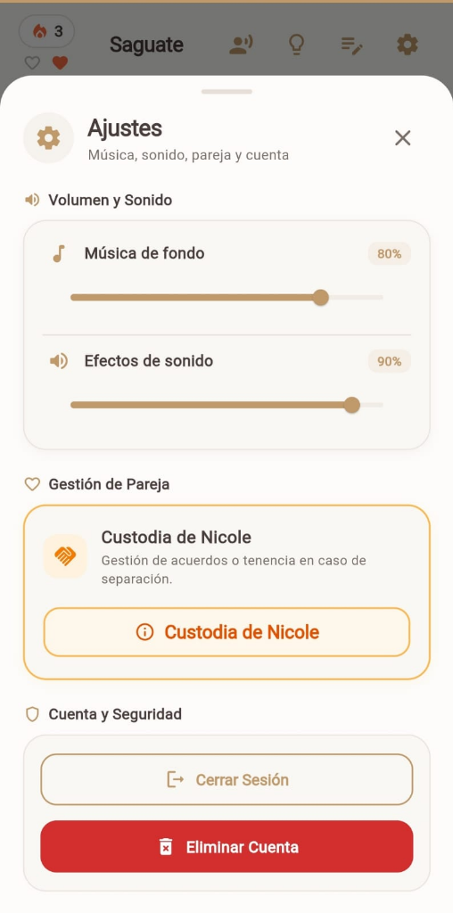

<div align="center">

# 🐾 Garabu
### Mascota Virtual Interactiva, Personalizable y Colaborativa en Tiempo Real para Parejas

[](https://flutter.dev)
[](https://dart.dev)
[](https://firebase.google.com)
[](https://riverpod.dev)
[](https://github.com/Mangelbarboza/Garabu)
[](LICENSE)

> *"Crear, cuidar y crecer juntos"* — Una experiencia gamificada 1-a-1 donde cada pareja diseña a mano su propia mascota, dibuja su ropa, personaliza su entorno y mantiene viva su racha diaria a través del cuidado mutuo y minijuegos competitivos.

</div>

---

## 📋 Tabla de Contenidos

1. [Descripción General](#-descripción-general)
2. [Características Principales](#-características-principales)
3. [Ingeniería y Optimización en la Nube](#-ingeniería-y-optimización-en-la-nube)
4. [Stack Tecnológico](#-stack-tecnológico)
5. [Arquitectura del Proyecto](#-arquitectura-del-proyecto)
6. [Instalación y Ejecución](#-instalación-y-ejecución)
7. [Suite de Pruebas](#-suite-de-pruebas)
8. [Capturas de Pantalla](#-capturas-de-pantalla)

---

## 🌟 Descripción General

**Garabu** nace de la combinación entre la nostalgia de las mascotas virtuales clásicas (*Tamagotchi / Pou*) y las dinámicas modernas de conexión afectiva para parejas. A diferencia de las aplicaciones con personajes genéricos predefinidos, en **Garabu** todo el universo visual es co-creado por la pareja:

- **Vinculación por Sala Privada:** Ambos usuarios se enlazan mediante un código único de invitación de 6 caracteres.
- **Co-creación Asimétrica:** Un miembro de la pareja dibuja la anatomía base de la mascota y configura sus rasgos faciales, mientras que el otro diseña sus primeras prendas y accesorios sobre la silueta en tiempo real.
- **Compromiso Diario:** La mascota requiere alimentación, hidratación, descanso nocturno y afecto. La racha diaria solo avanza cuando **ambos miembros** interactúan con ella.

---

## ✨ Características Principales

### 🎨 1. Estudio de Dibujo 2D y Algoritmo Flood Fill
- **Lienzo Vectorial/Raster Híbrido (`CustomPainter`):** Soporte para trazos suaves con grosor dinámico, borrador, deshacer/rehacer (*undo/redo*) y paleta cromática expandida.
- **Cubeta de Pintura (Flood Fill BFS):** Implementación propia en Dart puro del algoritmo *Breadth-First Search* sobre matrices de píxeles con tolerancia de color configurable, permitiendo rellenar regiones cerradas al instante sin bloquear el hilo principal de UI.
- **Edición No Destructiva:** Posibilidad de reabrir y editar dibujos ya existentes (cuerpo, prendas de ropa, frutas o escenarios de fondo) conservando la capa previa como base.

### 👀 2. Sistema Expresivo y Seguimiento Ocular Reactivo
- **Ojos y Boca Independientes:** Posicionamiento mediante coordenadas relativas normalizadas `(0.0 a 1.0)`, adaptándose a cualquier resolución de pantalla.
- **Eye-Tracking en Tiempo Real:** Cuando el usuario selecciona una fruta o bebida y la desplaza por la pantalla, las pupilas de la mascota calculan el ángulo vectorial hacia el puntero/dedo y siguen el alimento con la mirada.
- **Máquina de Estados Emocionales:** Expresiones dinámicas combinadas entre ojos y boca para estados de *felicidad, hambre, sed, sueño profundo, enfermedad, cosquillas y masticación*.

### 👗 3. Clóset Multicapa con Transformaciones 2D
- **Hasta 5 Prendas Simultáneas:** Renderizado multicapa que permite combinar sombreros, lentes, camisas, lazos y calzado al mismo tiempo.
- **Ajuste Espacial Directo:** Editor visual sobre la mascota con soporte de **traslación `(offsetX, offsetY)`**, **escalado `(scale)`** y **rotación `(rotation)`** para acoplar cualquier prenda a la anatomía única de cada mascota.
- **Tienda Integrada:** Catálogo con más de 25 accesorios base desbloqueables que pueden personalizarse con pintura.

### 🍎 4. Alacena Interactiva y Ciclo Circadiano de Energía
- **Alimentación Drag & Drop:** Inventario estilo alacena con contador de existencias. Al acercar la comida a la boca de la mascota, esta se abre anticipadamente y ejecuta una animación de masticado al soltarla.
- **Ciclo de Sueño Realista:** Interruptor de luz en la habitación. Al apagar la luz, toda la escena y el personaje se atenúan con atmósfera nocturna mientras la barra de energía se recarga progresivamente.

### 🔥 5. Racha Compartida con Doble Corazón
- **Verificación Dual:** Debajo del indicador de racha se muestran dos corazones individuales (uno por cada miembro de la pareja).
- **Encendido Diario:** Cualquier acción de cuidado (acariciar, alimentar, dar agua, jugar o dormir a la mascota) ilumina el corazón correspondiente del color del fuego de la racha.
- **Congelamiento de Racha:** Si uno de los dos no interactúa durante el día, la racha entra en estado *congelado* (`isStreakFrozen`), permitiendo su recuperación coordinada.

### 🎮 6. Sala de Minijuegos (Solitario y Multijugador)
- **Atrapa Garabutos:** Arcade de velocidad donde la mascota (equipada con su ropa actual y expresiones faciales vivas) atrapa frutas y estrellas mientras esquiva bombas (`-5s`) y recolecta relojes de tiempo (`+5s`).
- **Batalla de Cosquillas:** Minijuego de reflejos con multiplicadores de combo y modo *Fiebre de Carcajadas (x2)*.
- **Trivia de Pareja:** Cuestionario sincronizado en la nube donde un jugador responde sobre sus gustos y su pareja intenta adivinar las respuestas para ganar experiencia y monedas.
- **Dibuja y Adivina (Pinturillo):** Dinámica creativa por turnos para adivinar palabras secretas dibujando en el lienzo.
- **Récords Competitivos:** Cada minijuego registra y exhibe el récord histórico de ambos miembros de la pareja (`Récord de Persona 1 | Récord de Persona 2`) para fomentar la competencia sana.

### 💌 7. Buzón de Amor, Lenguaje y Ajustes
- **Buzón de Notas:** Envío de cartas dedicadas entre la pareja con historial persistente.
- **Frases Personalizadas:** Configuración de diálogos propios que la mascota muestra en globos de texto interactivos.
- **Panel de Ajustes:** Control independiente de volumen de música y efectos de sonido, gestión de cuenta y módulo de acuerdo de custodia.

---

## ⚡ Ingeniería y Optimización en la Nube

Uno de los pilares técnicos de **Garabu** es su diseño orientado a la **eficiencia extrema de lecturas y escrituras en Cloud Firestore**, permitiendo escalar a cientos de parejas simultáneas dentro de la capa gratuita (*Firebase Spark Plan*):

1. **Deduplicación de Interacciones Diarias en Memoria (`todayStr`):**
   - Las acciones repetitivas (como hacer cosquillas decenas de veces o dar varias frutas seguidas) evalúan primero el estado local del modelo `CoupleModel`.
   - Si el corazón diario del usuario ya fue encendido hoy y la racha del día está consolidada, se omiten escrituras redundantes a la red, reduciendo las operaciones de racha a un **máximo exacto de 2 escrituras por pareja al día** (un ahorro del **98.7%** en cuota de base de datos).
2. **Cálculo Determinista de Energía por Deltas de Tiempo:**
   - En lugar de utilizar *polling* o escrituras periódicas cada minuto para reducir o recargar la energía, el modelo `PetModel` almacena puntos de anclaje (`energyValue`, `lastSleptAt`, `sleepStartedAt`).
   - El estado vital actual se calcula mediante interpolación matemática continua en tiempo de ejecución ($-5\%/\text{hora}$ despierto, $+12.5\%/\text{hora}$ dormido), logrando precisión en tiempo real con **0 escrituras en segundo plano**.
3. **Arquitectura Híbrida Resiliente (Cloud + Mock Fallback):**
   - Los repositorios (`AuthRepository`, `LobbyRepository`, `PetRepository`) implementan inyección condicional que permite operar tanto conectados a Firebase en producción como en un entorno reactivo en memoria para pruebas automatizadas y desarrollo offline.

---

## 🛠️ Stack Tecnológico

| Capa | Tecnología / Herramienta | Propósito |
| :--- | :--- | :--- |
| **Framework UI** | Flutter 3.x (Dart) | Renderizado multiplataforma a 60/120 FPS (Android & Web PWA) |
| **Gestión de Estado** | Flutter Riverpod (`2.6.x`) | Inyección de dependencias, `StreamProvider` reactivos y estado inmutable |
| **Backend & BaaS** | Firebase Auth & Cloud Firestore | Autenticación persistente y sincronización en tiempo real entre parejas |
| **Motor Gráfico 2D** | Flutter `CustomPainter` + `dart:ui` | Lienzo de dibujo, composición de capas PNG y algoritmos de píxeles |
| **Persistencia Local** | SharedPreferences | Caché de sesión, preferencias de audio y estado local rápido |
| **Testing** | `flutter_test` | Pruebas unitarias de modelos, algoritmos BFS y pruebas de widgets |
| **Despliegue Web** | Vercel / Firebase Hosting | Distribución continua como Progressive Web App (PWA) |

---

## 🏗️ Arquitectura del Proyecto

El código fuente sigue una arquitectura **Feature-First + Clean Architecture** dividida en capas de `domain`, `data` y `presentation`:

```text
lib/
├── core/
│   ├── theme/
│   │   └── garabu_theme.dart                # Sistema de diseño: paleta café espresso, arena y crema
│   ├── utils/
│   │   ├── flood_fill.dart                  # Algoritmo BFS de relleno por inundación (Cubeta)
│   │   ├── image_exporter.dart              # Compresión y exportación de lienzos a PNG Base64
│   │   └── image_utils.dart                 # Utilidades de decodificación y manipulación de imágenes
│   └── widgets/
│       ├── garabu_image.dart                # Renderizador universal (Base64 / Network / Assets)
│       └── notebook_background.dart         # Fondo estilizado tipo libreta de dibujo
├── features/
│   ├── auth/                                # Registro, login y persistencia de sesión
│   ├── lobby/                               # Vinculación de pareja por código, rachas y récords
│   ├── pet/                                 # Modelo central PetModel, vitales, clóset y energía
│   ├── canvas/                              # Pantallas de dibujo (cuerpo, ropa, fruta, fondos)
│   ├── dashboard/                           # Escena principal interactiva, alacena, tienda y clóset
│   ├── minigames/                           # 4 minijuegos (Atrapa Garabutos, Cosquillas, Trivia, Pinturillo)
│   ├── mailbox/                             # Buzón de cartas entre la pareja
│   └── settings/                            # Configuración de audio, cuenta y custodia
└── main.dart                                # Punto de entrada e inicialización de proveedores
```

---

## 🚀 Instalación y Ejecución

### Prerrequisitos
- **Flutter SDK** `>=3.0.0`
- **Dart SDK** `>=3.0.0`
- Cuenta de Firebase (opcional para desarrollo local gracias al modo fallback integrado).

### 1. Clonar el repositorio
```bash
git clone https://github.com/Mangelbarboza/Garabu.git
cd Garabu
```

### 2. Instalar dependencias
```bash
flutter pub get
```

### 3. Ejecutar en entorno de desarrollo (Web / Móvil)
```bash
# Ejecutar en Chrome (Web / PWA)
flutter run -d chrome

# Ejecutar en dispositivo o emulador Android
flutter run
```

### 4. Compilar para Producción
```bash
# Generar build optimizado para Web / PWA
flutter build web --release

# Generar APK / AppBundle para Google Play Store
flutter build apk --release
flutter build appbundle --release
```

---

## 🧪 Suite de Pruebas

El proyecto cuenta con **23 pruebas automatizadas** que validan la lógica de dominio, la serialización de datos, el algoritmo de pintura y los componentes de interfaz:

```bash
# Análisis estático de código (0 issues)
flutter analyze

# Ejecución de todos los tests unitarios y de widgets
flutter test
```

- `test/flood_fill_test.dart`: Verifica la precisión del algoritmo BFS de cubeta de pintura y validación de límites de matriz.
- `test/pet_model_test.dart`: Valida el cálculo continuo de energía/sueño, niveles de experiencia, clóset de 5 prendas simultáneas, transformaciones `(scale, rotation, offsets)`, récords de minijuegos y rachas por pareja.
- `test/interactive_feed_and_canvas_test.dart`: Comprueba el inventario de frutas, configuración de boca/ojos y eventos táctiles del lienzo de dibujo.
- `test/widget_test.dart`: Verifica la inicialización integral de `GarabuApp`.

---

## 📸 Capturas de Pantalla

<div align="center">

| 🏠 Dashboard y Mascota Interactiva | 👗 Clóset Multicapa (5/5 Prendas) |
| :---: | :---: |
|  |  |
| *Vista principal con indicadores vitales, racha con corazones individuales y mascota personalizada.* | *Gestión de hasta 5 prendas simultáneas con soporte de edición, dibujo libre y ajuste espacial.* |

| 🎮 Sala de Juegos y Récords | ⚙️ Panel de Ajustes y Pareja |
| :---: | :---: |
|  |  |
| *Minijuegos en solitario y en pareja con marcador competitivo de récords en tiempo real.* | *Control de música/sonido, gestión de custodia en pareja y seguridad de la cuenta.* |

</div>

---

<div align="center">

Desarrollado con ❤️ y ☕ por **[Angel Barboza (Mangelbarboza)](https://github.com/Mangelbarboza)**  
*Estudiante de Informática Empresarial — Universidad de Costa Rica (UCR)*

Distribuido bajo la Licencia MIT. Consulta el archivo [LICENSE](LICENSE) para más información.

</div>
